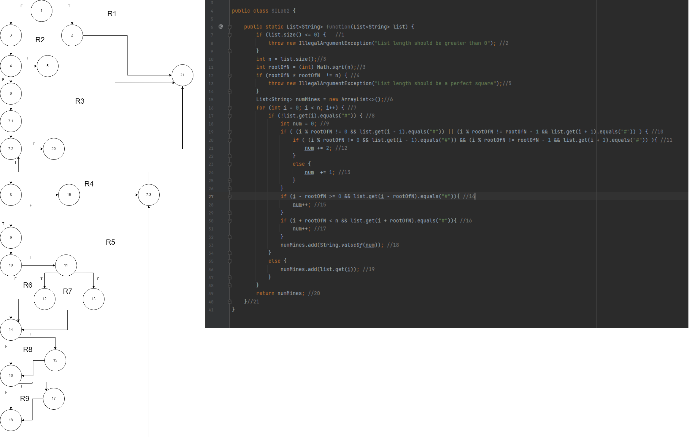

# SI_2022_lab2_203019

## Наце Ѓорѓиевски 203019

### Control Flow Graph

### Цикломатска комплексност

Цикломатската комплексност на овој код е 9, истата ја добив преку бројот на региони 9. Истиот број го добиваме и преку другите формули. Според формулата за предикати имаме 8 предикатни јазли + 1 = 9, а според формулата E-N+2 имаме 30-23+2 = 9.

### Тест случаи според критериумот Every statement
C0 може да се постигне со 3 тест случаи

прв случај: ако пратиме празна листа се изминуваат јазлите 1,2,21

втор случај: ако пратиме листа со 5 елементи се изминуваат јазлите 1,3,4,5,21

трет случај: ако ја пратиме листата ["0","#","0","#","0","#","0","#","#"] се изминуваат јазлите 1,3,4,6,7.1,7.2,7.3,8,9,10,11,12,13,14,15,16,17,18,19,20,21

Со овие три случаи се поминуваат сите јазли.

### Тест случаи според критериумот Every branch